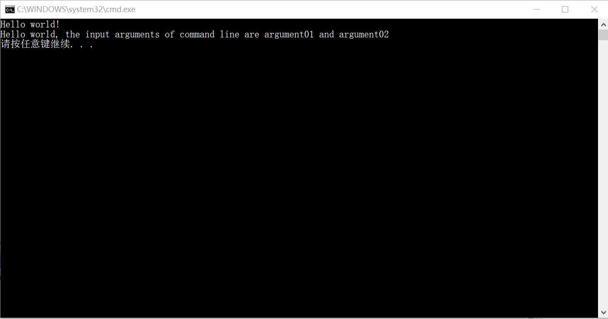
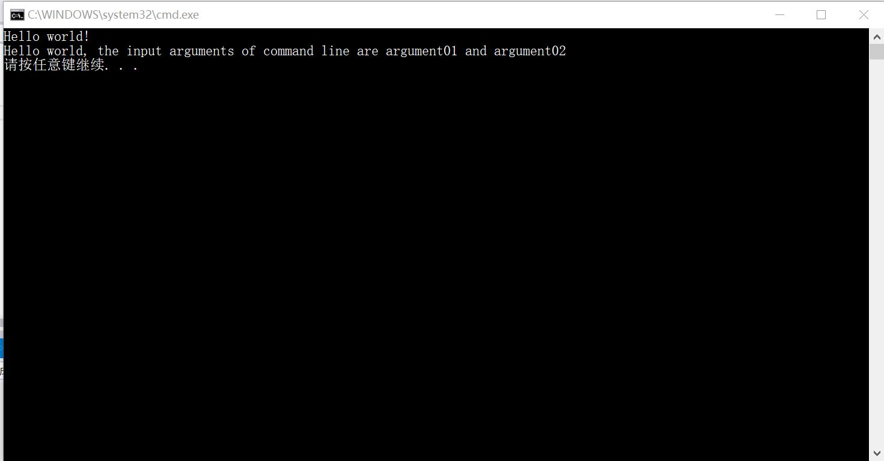
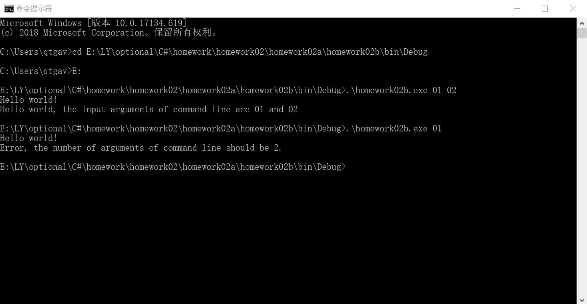

# Homework02 
C# homework02, by LuYuan

## introduction
1. The solution contains 5 projects, which were named as "homework02a" to "homework02e", representing the homework 1 to 5
2. The default startup project is "homework02a". If you want to execute other projects, remember to change the startup project
3. The implemetation is detailed in annotation of each project

## homework02a
### change log
##### first edition(8c4b6cb), released in 19:42, March 5th, 2019
1. use method Print() to print "hello world"
2. use method PrintWithCommandLine(String, String) to print "hello world" and the arguments of command line
3. With compiler of VS, the default arguments are "argument01" and "argument02" . With command line, the number of arguments is 2, or the terminal would print "error, the number of arguments of command line should be 2."
4. result screencut (by vs compiler) 
5. result screencut (by command line) 

## homework02b
### change log
##### first edition(8c4b6cb), released in 19:42, March 5th, 2019
1. use static method Print() to print "hello world"
2. use static method PrinrintWithCommandLine(String, String) to print "hello world" and the arguments of command line
3. With compiler of VS, the default arguments are "argument01" and "argument02" . With command line, the number of arguments is 2, or the terminal would print "error, the number of arguments of command line should be 2."
4. result screencut (by vs compiler) 
5. result screencut (by command line) 

## homework02c
##### first edition(8c4b6cb), released in 19:42, March 5th, 2019
1. create a button "Hello"
2. if you click button "Hello", the screen will print "hello world"
##### second edition(9cc3d83), released in 21:04, March 5th, 2019
1. add some annotation to MainWindow.xaml and MainWindow.xaml.cs
2. add a button "HelloWithArgs", if you click this button, the screen will print "hello world" and the arguments of command line
3. the default arguments are "argument01" and "argument02"

## homwork02d
##### first edition(8c4b6cb), released in 19:42, March 5th, 2019
